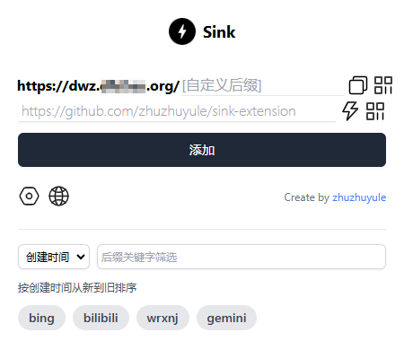
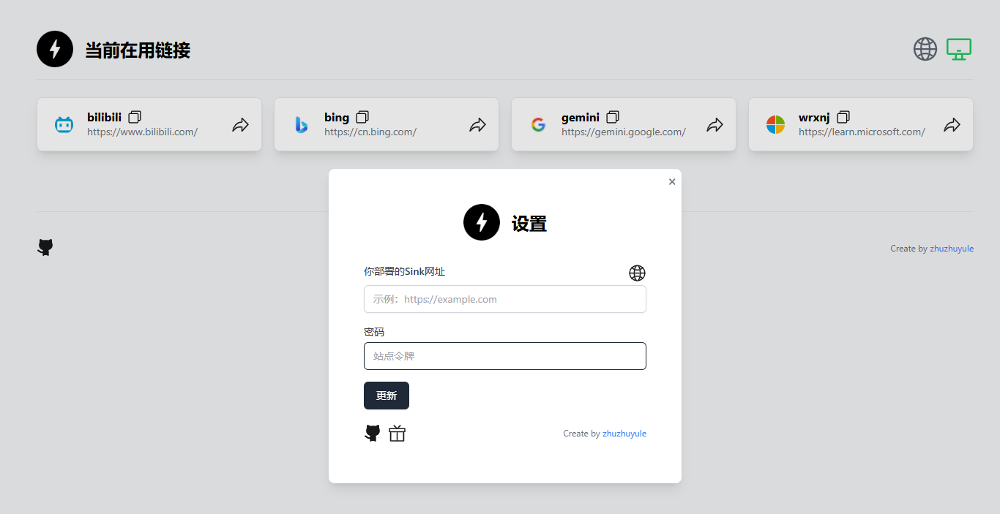

<h1 align="center">Sink短网址Chrome扩展程序sink-extension v0.05中文版</h1>
相关功能介绍前往 https://github.com/ggllqzy/sink-extension 查看，本页面只涉及汉化

### 🚀手动安装
您可以按照以下步骤安装该扩展：

下载[sink-tool-cn.zip](https://github.com/aabacada/sink-extension-cn/releases/tag/v0.0.5-cn)文件
1. 解压 zip 文件到自己安排的文件夹
2. 打开 Chrome 浏览器并导航到扩展程序页面（chrome://extensions/）。
3. 启用开发者模式。
4. 单击`加载未打包的扩展程序`按钮。
5. 选择扩展的根目录`sink-tool-cn`
6. 

### ✨ 特点
* 立即将当前网页URL缩短为Sink短链接。
* 可定制的短链接后缀。
* 使用快速复制功能预览缩短的链接。
* 登录您的Sink账户来管理生成的短链接。
  

### ☀️ 截图

* 弹出页面

  

* 设置页面 - 登录

  

